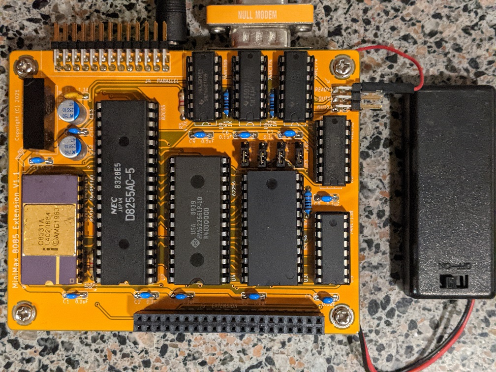

# minimax8085-apu-ext
Arithmetic Processor and Extension Board for MiniMax 8085 SBC

## Introduction

The MiniMax 8085 Arithmetic Processor and Extension board adds to [MiniMax 8085 SBC](https://github.com/skiselev/minimax8085) an AMD Am9511A / Intel 8231A Arithmetic Processor Unit (APU), Intel 8255 Programmable Parallel Interface (PPI), Intel 8254 Programmable Interrupt Timer (PIT), and switchable 32 KiB SRAM, that can swapped in instead of MiniMax 8085 on-board ROM. 
It is designed to be plugged on the top of MiniMax8085 using 2x20 pin header / pin socket.

## Hardware Documentation

### Schematic and PCB Layout

[Schematic - Version 1.1](KiCad/Mini8085Ext-Schematic-1.1.pdf)

[PCB Layout - Version 1.1](KiCad/Mini8085Ext-Board-1.1.pdf)

### Design Description

#### Address Decode / Chip Select

The Arithmetic Processor and Extension board uses 74HCT138 3-to-8 decoder U5 for address decode:
* Enable signal E3 of 74HCT138 is connected to IO/M signal, and therefore the decoder is enabled only during I/O operations, when IO/M signal value is HIGH
* Enable signals /E1 and /E2 of 74HCT138 are connected to address lines A6 and A7, so that decoder is enabled when both of these signals are low - 0x00 - 0x3F address range
* Inputs A0-A2 of 74HCT138 are connected to address lines A3 - A4, therefore each output of 74HCT138 is active (LOW) for a block of 8 consequitive I/O addresses, /O0 - for 0x00-0x07, /O1 - for 0x08-0x0F, ... , /O6 for 0x30-0x37, and /O6 for 0x38-0x3F
* Output /O2 of 74HCT138 - /CFG_CS signal - is connected to the input of the 74HCT32 OR gate U8D, another input of that gate is connected to /WD signal. As the result, the output of the gate U8D - CFG_WR is active (LOW) during write cycles to 0x10-0x17 I/O range. CFG_WR is used as a clock signal for 74HCT74 flip-flop U7B, which output /Q is connected to /ROM_DIS signal, that disables MiniMax 8085 on-board ROM, and enables the SRAM on the extension board
* Output /O3 of 74HCT138 - /PPI_CS signal - is connected to the /CS input of 8255 PPI U2, therefore the PPI can be accessed using 0x18 - 0x1F address range
* Output /O4 of 74HCT138 - /PIT_CS signal - is connected to the /CS input of 8254 PIT U3, therefore the PIT can be accessed using 0x20 - 0x27 address range
* Output /O5 of 74HCT138 - /APU_CS signal - is connected to the /CS input of 8231 APU U1, therefore the APU can be accessed using 0x28 - 0x2F address range

#### Arithmetic Processor Unit

Intel 8131A/AMD Am9511A APU is accessed using I/O ports in range 0x28 - 0x2F. The APU uses the lower address bit A0 to select between data register (A0 = 0, I/O address - 0x28) or command/status register (A1 = 1, I/O address - 0x29). The APU is programmed by entering the data into its stack by writing the data register, and then sending the command by writting it to the command register. Once the command completes, the APU will issue an interrupt, which is connected to 8085 TRAP (unmaskable interrupt) signal. The results can be read then from the stack by reading the data register. Please refer to the [Intel 8231A APU Datasheet](Documentation/Intel-8231A_APU-Datasheet.pdf) and the [AMD Am9511A/Am9512 Floating Point Processor Manual](Documentation/AMD-Am9511A-9512-FP_Processor_Manual.pdf) for the detailed programming information.

The APU interface also includes a wait cycle generator built using two 74HCT74 flip flops U6A and U6B, and a few logic gates - U8C, U9A, U9B. This logic generates one or more states when APU is accessed, depending on the /PAUSE output of the APU. The READY signal - pin 1 on header J1 must be connected to the READY signal on MiniMax 8085. Note that READY signal is not provided on the extension connector, therefore a short wire should be used instead.

#### Programmable Parallel Interface

Intel 8255 PPI is accessed using I/O ports in range 0x18 - 0x1F. All the PPI I/O pins are routed to the connector J4. This connector also provides ground and fused 5V power supply. It can be used to connect PPIDE, Extension ROMs, or other peripherals.

Please refer to [Intel 8255 PPI Datasheet](Documentation/Intel-8255_PPI-Datasheet.pdf) for programming information

#### Programmable Interval Timer

Intel 8254 PIT is accessed using I/O ports in range 0x20 - 0x27. The PIT channels are connected as following:
* Channel 0 - used to generate periodic interrupts:
  * The CLK0 input is connected to PIT_CLK - the system clock divided by two using 74HCT74 flip flop U7A. Given the CPU frequency of 3.072 MHz, the PIT_CLK frequency is 1.536 MHz
  * The GATE0 input is tied up, therefore the channel 0 is always enabled
  * The OUT0 output is connected to 8085's RST5_5 interrupt input
  * To generate periodic interrupts, the PIT needs to be configured in mode 2, and RST5.5 interrupt needs to be unmasked.
* Channels 1 and 2 are available for user
  * CLK1 and CLK2 inputs can be either connected to PIT_CLK by placing jumpers across pins 1-2 of JP1 and JP3 respectively, or to an external clock connected to pin 2 (clock) and pin 3 (GND) of JP1 and JP3
  * GATE1 and GATE2 inputs can be: tided up (enabled) by placing jumpers across pins 1-2 of JP2 and JP4 respectively, tided down (disabled) by placing jumpers across pins 2-3 of JP2 and JP4, or connected to an external signal, in such case, the external signal should be connected to pin 2 and the ground to pin 3.
  * OUT1 and OUT2 outputs are available on connectors J2 (OUT1) and J3 (OUT2) respectively

Please refer to [Intel 8254 PIT Datasheet](Documentation/Intel-8254_PIT-Datasheet.pdf) for programming information

#### SRAM Extension

The extension board provides 32 KiB SRAM, which can be switched in at address 0x0000 instead of MiniMax 8085 on-board ROM. The switching is accomplished by writing 0x01 to I/O port 0x10 (CFG register). To switch ROM back, write 0x00 to I/O port 0x10.

### Bill of Materials

#### Version 1.1

[MiniMax8085 Extension on Mouser.com](https://www.mouser.com/ProjectManager/ProjectDetail.aspx?AccessID=52aba2a20b) - View and order all components except of the PCB and the APU.

[MiniMax8085 Extension on OSH Park](https://oshpark.com/shared_projects/crN8OyKx) - View and order the PCB.

Component type     | Reference  | Description                                 | Quantity | Possible sources and notes 
------------------ | ---------- | ------------------------------------------- | -------- | --------------------------
PCB                |            | MiniMax 8085 Extension PCB                  | 1        | Order from a PCB manufacturer of your choice using provided Gerber or KiCad files
Integrated Circut  | U1         | Intel 8231A or AMD Am9511A APU, CERDIP-24   | 1        | eBay
Integrated Circut  | U2         | Intel 8255A, Intersil 82C55A or similar     | 1        | Mouser [968-CP82C55AZ](https://www.mouser.com/ProductDetail/968-CP82C55AZ)
Integrated Circut  | U3         | Intel 8254, Intersil 82C54 or similar       | 1        | Mouser [968-CP82C54Z](https://www.mouser.com/ProductDetail/968-CP82C54Z)
Integrated Circut  | U4         | 62256, AS6C62256-55PCN or similar, DIP-28   | 1        | Mouser [913-AS6C62256-55PCN](https://www.mouser.com/ProductDetail/913-AS6C62256-55PCN)
Integrated Circut  | U5         | 74HCT138 3-to-8 line decoder, DIP-16        | 1        | Mouser [595-SN74AHCT138N](https://www.mouser.com/ProductDetail/595-SN74AHCT138N) Note: Possible replacements: 74HCT138, 74LS138, 74ALS138
Integrated Circut  | U6, U7     | 74HCT74 dual D-type flip flops, DIP-14      | 2        | Mouser [595-SN74AHCT74N](https://www.mouser.com/ProductDetail/595-SN74AHCT74N) Note: Possible replacements: 74HCT74, 74LS74, 74ALS74
Integrated Circut  | U8         | 74HCT32 quad 2-input OR gate, DIP-14        | 1        | Mouser [595-SN74AHCT32N](https://www.mouser.com/ProductDetail/595-SN74AHCT32N) Note: Possible replacements: 74HCT32, 74LS32, 74ALS32
Integrated Circut  | U9         | 74HCT00 quad 2-input NAND gate, DIP-14      | 1        | Mouser [595-SN74AHCT00N](https://www.mouser.com/ProductDetail/595-SN74AHCT00N) Note: Possible replacements: 74HCT00, 74LS00, 74ALS00
DC-DC Converter    | U10        | TBA1-0512E, 5V to 12V, 1W DC-DC Converter, SIP-6 | 1   | Mouser [495-TBA1-0512E](https://www.mouser.com/ProductDetail/495-TBA1-0512E)
IC Socket          | U1, U3     | DIP-24, 600 mil socket                      | 2        | Mouser [649-DILB24P-223TLF](https://www.mouser.com/ProductDetail/649-DILB24P-223TLF)
IC Socket          | U2         | DIP-40, 600 mil socket                      | 1        | Mouser [649-DILB40P223TLF](https://www.mouser.com/ProductDetail/649-DILB40P223TLF)
IC Socket          | U4         | DIP-28, 600 mil socket                      | 1        | Mouser [649-DILB28P223TLF](https://www.mouser.com/ProductDetail/649-DILB28P223TLF)
IC Socket          | U5         | DIP-16, 300 mil socket                      | 1        | Mouser [649-DILB16P-223TLF](https://www.mouser.com/ProductDetail/649-DILB16P-223TLF)
IC Socket          | U6 - U9    | DIP-14, 300 mil socket                      | 4        | Mouser [649-DILB14P-223TLF](https://www.mouser.com/ProductDetail/649-DILB14P-223TLF)
Header             | JP1 - JP4  | 1x3 pin header, 2.54 mm pitch, straight     | 4        | Mouser [649-68000-203HLF](https://www.mouser.com/ProductDetail/649-68000-203HLF)
Jumpers            | JP1 - JP4  | Jumper, 2.54 mm pitch                       | 4        | Mouser [806-SX1100-B](https://www.mouser.com/ProductDetail/806-SX1100-B)
Header             | J1 - J3    | 2x3 pin header, 2.54 mm pitch, right angle  | 1        | Mouser [649-68020-106HLF](https://www.mouser.com/ProductDetail/649-68020-106HLF)
Header             | J4         | 2x13 pin header, 2.54 mm pitch, right angle | 1        | Mouser [649-68021-226HLF](https://www.mouser.com/ProductDetail/649-68021-226HLF)
Header             | J5         | 2x20 pin stacking header, 2.54 mm pitch, straight | 1  | Mouser [855-M20-6102045](https://www.mouser.com/ProductDetail/855-M20-6102045), Mouser [200-ESQ12014LD](https://www.mouser.com/ProductDetail/200-ESQ12014LD)
Capacitor          | C1 - C11   | 0.1 µF, MLCC, 5 mm lead spacing             | 11       | Mouser [810-FG28X7R1H104KNT6](https://www.mouser.com/ProductDetail/810-FG28X7R1H104KNT6)
Capacitor          | C12, C13   | 47 µF, 25V, Electrolytic, 2.5 mm lead spacing | 2      | Mouser [80-A750EK476M1EAAE40](https://www.mouser.com/ProductDetail/80-A750EK476M1EAAE40)
Resistor           | R1 - R3    | 1k                                          | 3        | Mouser [603-MFR-25FBF52-1K](https://www.mouser.com/ProductDetail/603-MFR-25FBF52-1K)
Resistor           | R4, R4     | 4.7k                                        | 2        | Mouser [603-MFR-25FBF52-4K7](https://www.mouser.com/ProductDetail/603-MFR-25FBF52-4K7)
Standoff           |            | 15.24 mm x M3, PC/104 stacking standoff     | 4        | Mouser [855-R6104-02](https://www.mouser.com/ProductDetail/855-R6104-02)

## Installing Programming MiniMax 8085 Arithmetic Processor and Extension board

The board stacks together with MiniMax 8085 SBC using PC/104 style 2x20 pin headers. See the BOM above for the recommended part numbers

## Programming MiniMax 8085 Arithmetic Processor and Extension board

### APU

This sample shows how to run the PUPI (PUSH PI) instruction in MON85.

First set interrupt service routine (ISR) for TRAP interrupt. This needs to be done once (possibly repeated if the board is powered down and SRAM content is lost).
The ISR code is:
<pre><code>
        IN      29h     ; READ APU STATUS - CLEAR INTERRUPT
        EI              ; RE-ENABLE INTERRUPTS
        RST     1       ; RETURN CONTROL TO MON85
</code></pre>

MON85 commands:
* C> **E E024** - Edit memory location E024
* E024 00=**DB** - IN 29
* E025 00=**29**
* E026 00=**FB** - EI
* E027 00=**CF** - RST 1
* E028 00=**(Press ESC to exit memory edit mode)**

Next, set MON85 user area to E000. MON85 uses this are for RST interrupts vectors:
* C> **U E000** - Set user area to 0xE000

Send PUPI command to the APU:
* C> **O 29 1A** - Send PUPI command to APU
* BC=4F00  DE=FFD7  HL=001A  SP=FFFE  PC=E027   PSW=0044   FLAGS=-Z---P--

Read back the result from the APU:
* C> **I 28** - Read most significant byte from APU
* DATA=02
* C> **I 28** - Read next byte
* DATA=C9
* C> **I 28** - Read next byte
* DATA=0F
* C> **I 28** - Read the least significant byte from APU
* DATA=DA

### SRAM

The code below copies the MON85 code to the RAM and switches ROM for RAM. Refer to the comments in the code for MON85 instructions. The HEX code is given below after the source code.

Source code:
<pre><code>
; COPY ROM MONITOR TO LOW RAM AND SWITCH ROM FOR LOW RAM
;
; USE THE FOLLOWING MON85 COMMANDS TO RUN:
; C> L E080
; <COPY/UPLOAD HEX>
; C> G E080
; BC=0000  DE=1000  HL=F100  SP=FFA0  PC=E0B2   PSW=FF54   FLAGS=-Z-A-P--
; C>
; 
; COPY ROM MONITOR TO HIGH RAM
        LXI     B,1000H
        LXI     D,0E100H
        LXI     H,0000H

LOOP1:
        MOV     A,M
        XCHG
        MOV     M,A
        XCHG
        INX     D
        INX     H
        DCR     C
        JNZ     0E089H  ; LOOP1
        DCR     B
        JNZ     0E089H  ; LOOP1

; SWAP ROM FOR LOW RAM
        MVI     A,1
        OUT     10H

; COPY MONITOR FROM HIGH RAM TO LOW RAM
        LXI     B,1000H
        LXI     D,0000H
        LXI     H,0E100H

LOOP2:
        MOV     A,M
        XCHG
        MOV     M,A
        XCHG
        INX     D
        INX     H
        DCR     C
        JNZ     0E0A4H  ; LOOP2
        DCR     B
        JNZ     0E0A4H  ; LOOP2

; RETURN TO MONITOR
        RST     1
</code></pre>

HEX code:
<pre><code>
:100000000100101100E12100007EEB77EB13230DBE
:10001000C289E005C289E03E01D310010010110041
:10002000002100E17EEB77EB13230DC2A4E005C2B3
:03003000A4E0CF7A
:00000001FF
</code></pre>

## Release Notes

### Changes

* Version 1.1
  * Fix DC-DC converter footprint
  * Use rounded traces
* Version 1.0
  * Initial design

### Known Issues

* Version 1.1
  * APU interrupt on operation completion should optional. Add a jumper to disconnect /END pin of U1/8231A from /INT signal
* Version 1.0
  * Incorrect footprint for U10 DC-DC converter
